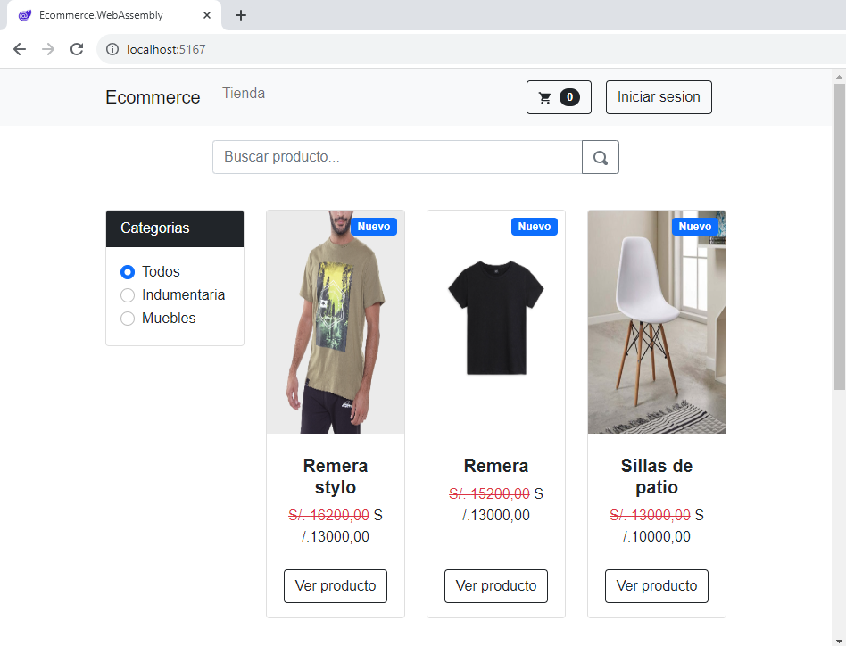
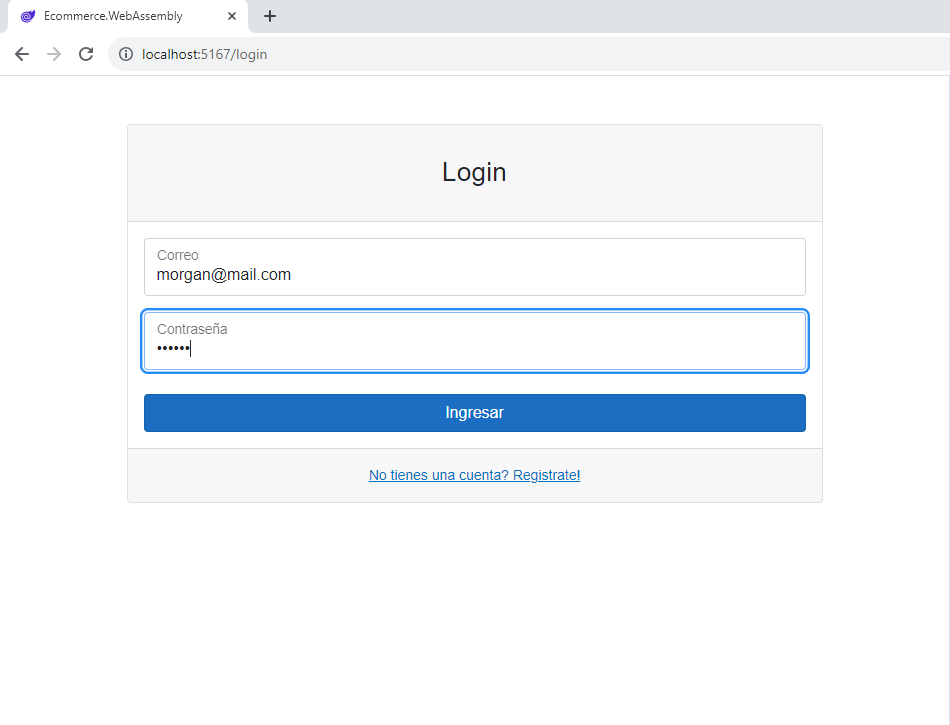
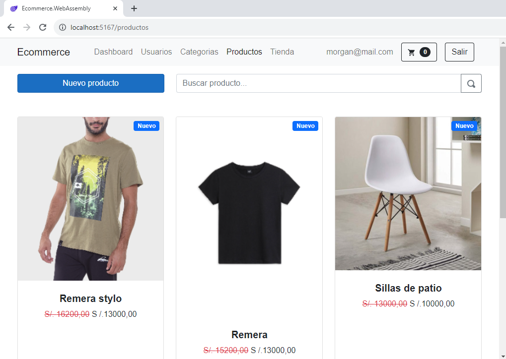
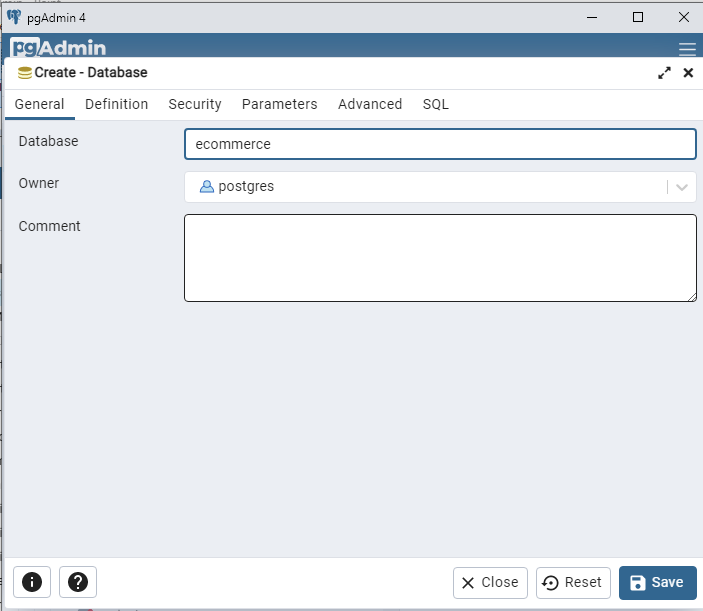
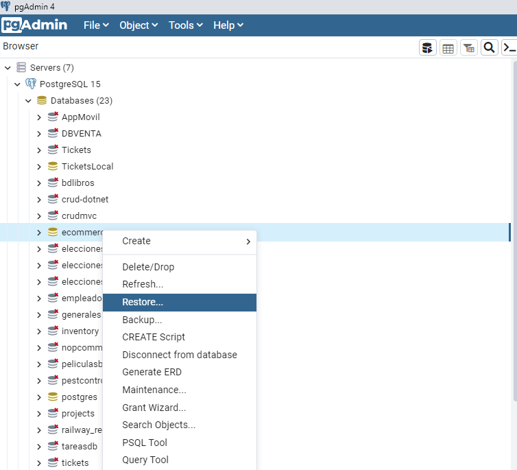
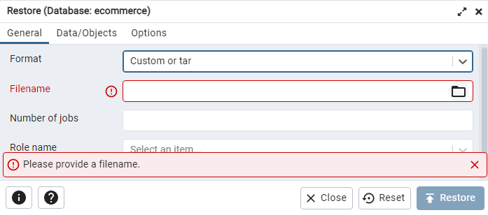

# Ecommerce Demo


¡Bienvenido al demo Ecommerce!




Este repositorio contiene una demostración de un sistema de comercio electrónico desarrollado con .NET, utilizando una arquitectura en capas. La aplicación consta de un Web API para el backend y un frontend implementado con Blazor.





## Clonar y Ejecutar Localmente

### Clonar el Proyecto

Para clonar este repositorio a tu máquina local, utiliza el siguiente comando:

```
git clone https://github.com/serdel1979/ecommerce.git
```

### Configuración del Proyecto
1. **Base de datos Postgres:**

    - Crea una base de datos llamada ecommerce:

   

2. **Base de datos Postgres:**

    - Importar ecommerce.sql de la raíz del proyecto clonado

   

    - Seleccionar ecommerce.sql desde la raíz del proyecto clonado

   

3. **Backend (Web API):**
   - Navega al directorio del proyecto backend:
     ```
     cd ecommerce/Ecommerce.Api
     ```
   - Asegúrate de tener configurada una cadena de conexión válida en el archivo `appsettings.json` para tu base de datos.


### Ejecutar el Proyecto

1. **Backend (Web API):**
   - Desde el directorio del proyecto backend (`Backend/Ecommerce.Api`), ejecuta el siguiente comando para iniciar el servidor API:
     ```
     dotnet run
     ```

2. **Frontend (Blazor):**
   - Desde el directorio del proyecto frontend (`Frontend/Ecommerce.WebAssembly`), ejecuta el siguiente comando para iniciar la aplicación Blazor:
     ```
     dotnet run
     ```

### Acceder a la Aplicación

Una vez que ambos servidores estén en funcionamiento, abre tu navegador web y visita `http://localhost:<puerto>` para acceder al frontend de la aplicación.


### Credenciales de acceso
- Ingresa con el usuario: morgan@mail.com

- Ingresa la clave: morgan

¡Disfruta explorando la demostración de este sistema de comercio electrónico!
